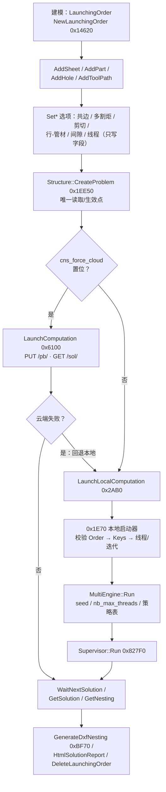
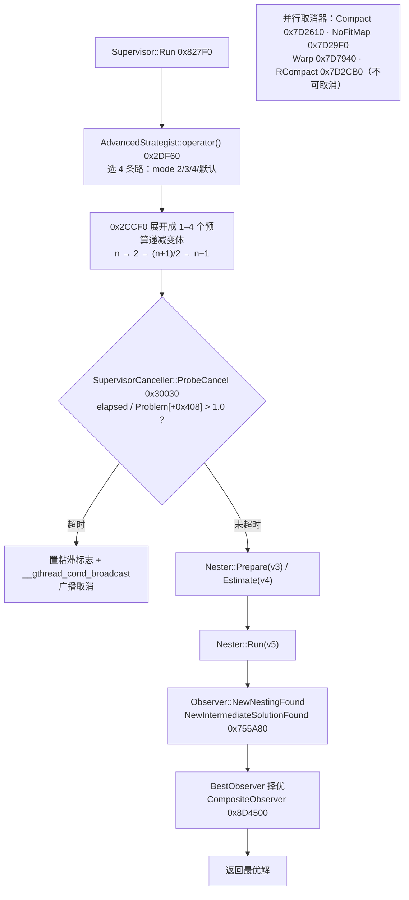
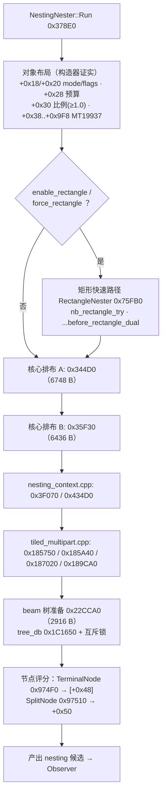
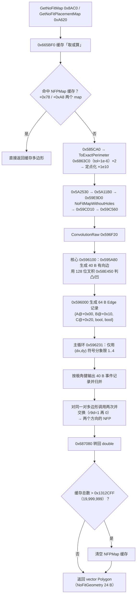
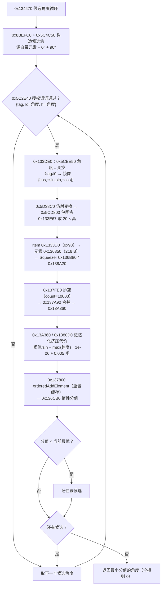
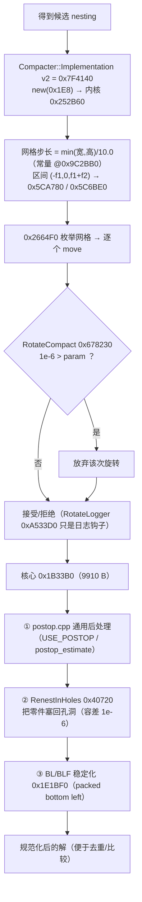
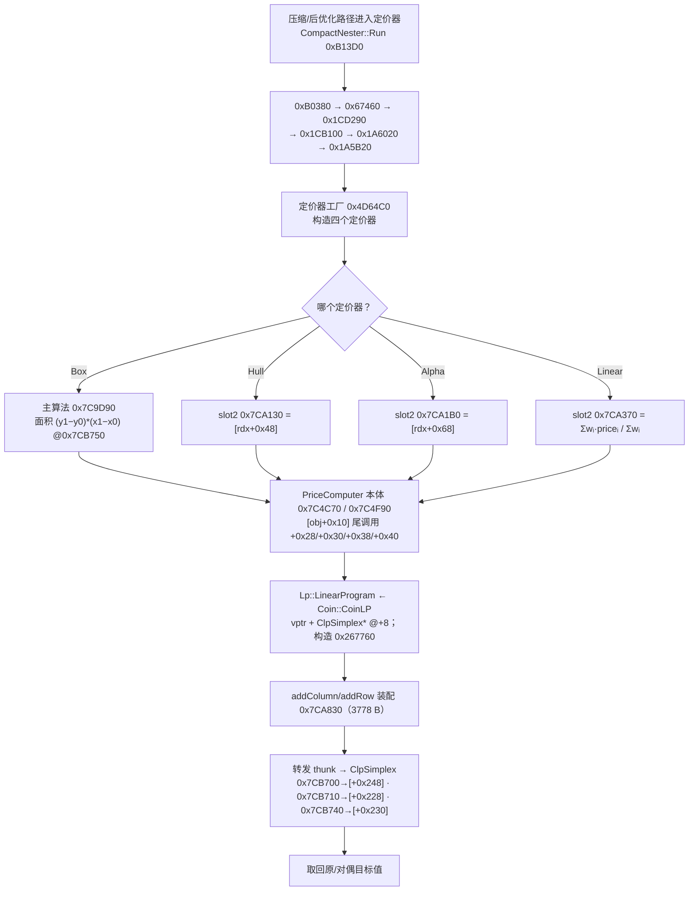

# 主要算法流程图

配套的可渲染图（双击用浏览器打开）：

| 图 | 内容 | 出处 |
|---|---|---|
| [`FLOW_MAIN.svg`](FLOW_MAIN.svg) | **主流程**：建模 → 选项 → 云端/本地分派 → 求解 → 取解 → 输出 | §5 · §6 |
| [`FLOW_SEARCH.svg`](FLOW_SEARCH.svg) | **搜索**：多策略并发 + 级联预算 + 观察者择优 + 时间闸门 | §7.2 |
| [`FLOW_NESTER.svg`](FLOW_NESTER.svg) | **Nester 内部**（以 `NestingNester 0x378E0` 为例） | §7.2 |
| [`FLOW_NFP.svg`](FLOW_NFP.svg) | **几何**：No-Fit Polygon（边界 Convolution）计算链路 | §7.1 |
| [`FLOW_ROW.svg`](FLOW_ROW.svg) | **行排样**：逐零件路径（候选角度 → 分值 → 取最小） | §21–§38 |
| [`FLOW_POSTOP.svg`](FLOW_POSTOP.svg) | **后优化**：Compaction + 收尾三连 pass | §7.2 |
| [`FLOW_LP.svg`](FLOW_LP.svg) | **LP/定价层**：`Prc::*PriceComputer` + `Coin::CoinLP` | §7.3 |

另有 [`ARCHITECTURE.svg`](ARCHITECTURE.svg)（分层架构）与 [`ROW_PATH.svg`](ROW_PATH.svg)（逐零件调用链）。

> 生成与校验：`python tools/gen_flow.py`（画流程图 + 分层图）· `python tools/check_arch.py`
> 校验全部 SVG：**不越界、不重叠、连线不穿过无关框**（当前 **9/9 通过**）。

---

## 1. 主流程（`FLOW_MAIN.svg`）



**要点**

* `Set*` 导出**只写 `LaunchingOrder` 字段**；唯一让它们生效的是 `Structure::CreateProblem 0x1EE50`（15305 B）。
* `LaunchComputation ⇄ LaunchLocalComputation` **互调** ⇒ "云端不可用则本地算 / 强制云端"双向回退（已证实）。
* 计算控制族（`Wait*`/`Cancel*`/`Terminate*`）都以 `cmp byte [rcx+0x48], 0` 起手分支（`Order+0x48` = 计算模式）。

---

## 2. 搜索：多策略并发（`FLOW_SEARCH.svg`）



**要点**

* 两个阶段各自的多线程：`SetLocalMaximumThreads` / `SetLocalMaximumIterations` ⇒ multi 阶段与 nesting 阶段分开配线程。
* `Multi::NestingNester` 自带 `std::mt19937`（构造器 `0x342E0`：`imul eax,eax,0x6C078965`、`[+0x9F8] = 624`）
  ⇒ **带随机扰动的确定性局部搜索**；无任何 GA 字符串 ⇒ 不是遗传算法。
* 12 个策略的 `Run` 槽即各类的最大函数（Nesting `0x378E0` 14374 B、Tiling `0x46940` 16258 B、Row `0x913E0` 12380 B …）。

---

## 3. Nester 内部（`FLOW_NESTER.svg`）



**未确认**：beam width 的具体常量未找到（切入口：`0x1C1650` 的实现与 `0x22CCA0` 中 `ebp` 的来源）。

---

## 4. 几何：NFP 链路（`FLOW_NFP.svg`）



**要点**

* **极角归并完全不用 `atan2`**：全库唯一的 `atan2` 是 `0x634C70`（41 B，x87 `fpatan`），只被 `Geom::SignedAngleInRad 0x5C5280` 使用；象限分类只用 `(dx,dy)` 的符号 ⇒ 全部是 **128 位精确谓词**。
* 复杂度上限 `m_max_complexity` 在 `NoFitContext+0xE8`，默认 **25000 = 0x61A8**；缓存清空阈值 **19,999,999 = 0x1312CFF**。
* 定位：**算法结构（象限分类 + 事件归并 + 精确谓词）已证明**；"等价于教科书式 edge-merge Minkowski 和"是**推断**。
* 偏移（inflate/gap）：`AddInflatedToolPathToPart 0x12C60` 对外轮廓 `+gap`、对内孔用 `btc` 取反符号位 ⇒ `−gap`（**没有** JoinType/MiterLimit 概念）；`0x58A7E0` 按 `N = floor(dist/step + 0.5)` 分 N 步增量偏移。

---

## 5. 行排样：逐零件路径（`FLOW_ROW.svg`）



**最终公式**（两端均已命名）：

```
score = Squeezer::cost(上一条记录的 node, 当前元素) − 环形面积 / cfg[+0x08]
```

细节见 [`../../re/findings_lp_use.md`](../../re/findings_lp_use.md) §21–§38：
元素（216 B）布局由 **15 条 `static_assert`** 锁进编译期；`0x5CC6A0` 是鞋带公式面积。

---

## 6. 后优化（`FLOW_POSTOP.svg`）



**要点**：`[obj+0x10] = min(f1,f2)/10.0` 就是位移步长（tolerance/mesh）；
字符串证据含 `before_shake`/`shaker_`/`after_shake`（shake 抖动）、`Swap 180 begin`（180° 交换）。

---

## 7. LP 与定价层（`FLOW_LP.svg`）



**要点与限定**

* 这一层是**活的**：`struct` 的 vtable **地址点**被真实 `lea` 引用（如 `Prc::BoxPriceComputer` 地址点 `0xA3B0C0` 被 `0x4D9AE2`/`0x7CA0E2` 引用）。
* ⚠️ 方法学：按 vtable **头部**（`vtable+0`）搜索会得到"0 引用"的假结论 —— vptr 指向 **地址点（`vtable+16`）**。
* **是否构成"列生成"尚未证实**（`findings_lp.md` §7.3）；`Prc::BoostAlpha`/`SurfaceCoeffs`/`DimAlpha` 只有 RTTI 名、零指针引用 ⇒ 非多态数据结构。
* 本机未安装 COIN-OR Clp，`lcns` 用零依赖自研 `Simplex` 作 LP 后端（**已知差异，已如实记录**）。

---

## 8. 已证实 / 推断 / 未确认 的标注约定

| 标注 | 含义 |
|---|---|
| 已证实 | 有指令级或数据级证据（本文件的 RVA 均可复核） |
| 推断 | 结构已证明，但"等价于某教科书算法"是解释性判断（如 NFP 与 Minkowski 和） |
| 未确认 | 明确列出缺口与切入口（如 beam width 常量、point-in-polygon 例程、列生成是否成立） |

完整的未恢复项总清单见 [`../../re/REPORT.md`](../../re/REPORT.md) §10 与 §11–§12。
