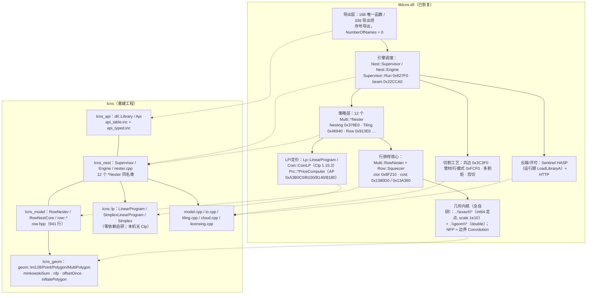
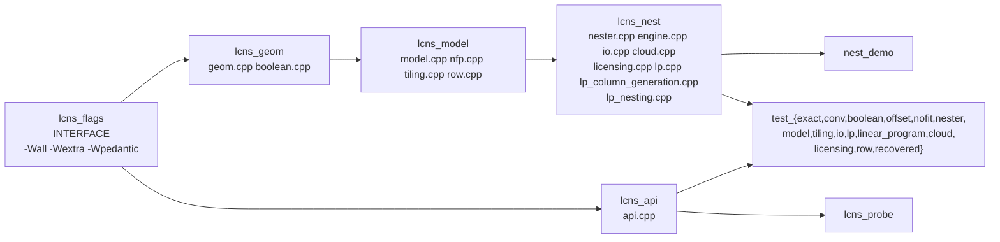

# lcns 架构图与模块说明

本文件是 `liblcns.dll`（Optalog CNS 排样引擎，`5.0 - 68e2d90e72b4 5449`，2019-06-28）
逆向成果与其等价重建工程 `lcns` 的架构总览。

> 可渲染图（直接双击用浏览器打开）：
> - [`ARCHITECTURE.svg`](ARCHITECTURE.svg) —— 分层架构（左＝DLL 已恢复的真实类型与地址，右＝lcns 对应实现）
> - [`ROW_PATH.svg`](ROW_PATH.svg) —— 逐零件路径的完整调用链（本工程最后闭合的那条链）
>
> 生成脚本：[`../tools/gen_arch.py`](../tools/gen_arch.py)（`python tools/gen_arch.py`），
> 坐标与画布高度由内容计算、并校验 XML 合法性。

---

## 1. 分层架构



### ASCII 速览（终端可读）

```
        liblcns.dll（已恢复）                          lcns（重建）
  ┌──────────────────────────────────┐      ┌──────────────────────────────────┐
  │ 导出层  168 函数 / 336 项         │ ───► │ lcns_api   dll::Library / Api    │
  ├──────────────────────────────────┤      ├──────────────────────────────────┤
  │ 引擎    Supervisor::Run 0x827F0  │ ───► │ lcns_nest  Supervisor / Engine   │
  │         beam 0x22CCA0            │      │            12 个 *Nester 同名类    │
  ├──────────────────────────────────┤      ├──────────────────────────────────┤
  │ 行核心  RowNester 0xA3BB40       │ ───► │ lcns_model RowNester/RowNestCore │
  │         Squeezer 0x1380D0        │      │            row::*  (row.hpp 941) │
  ├──────────────────────────────────┤      ├──────────────────────────────────┤
  │ 几何    ..\exact\*  ..\geom\*    │ ───► │ lcns_geom  geom::*  (自研)        │
  │         NFP = 边界 Convolution    │      │            NoFitMap / nfp        │
  ├──────────────────────────────────┤      ├──────────────────────────────────┤
  │ LP      Clp 1.15.3 + Prc::*      │ ───► │ lcns::lp   Simplex（零依赖）      │
  ├──────────────────────────────────┤      ├──────────────────────────────────┤
  │ 工艺    共边 0x3C3F0 / 管材 0xFCF0│ ───► │ Order 工艺字段 + detectCommonCuts│
  │ 云端    Sentinel HASP + HTTP     │ ───► │ cloud::* / licensing::*          │
  └──────────────────────────────────┘      └──────────────────────────────────┘
```

---

## 2. 构建产物与依赖关系

`CMakeLists.txt` 定义 4 个库 + 2 个可执行 + 15 个测试目标：



| 目标 | 源文件 | 对应 DLL 子系统 |
|---|---|---|
| `lcns_geom` | `src/geom.cpp`(729) `src/boolean.cpp`(602) | `..\exact\*` + `..\geom\*`（`Geom::MultiPolygon` 等） |
| `lcns_model` | `src/model.cpp`(146) `src/nfp.cpp`(123) `src/tiling.cpp`(218) `src/row.cpp`(133) | Problem/Order 模型、`NoFitMap`、tiling 图案、`Row` 距离/挤压 |
| `lcns_nest` | `src/nester.cpp`(1013) `src/engine.cpp`(244) `src/io.cpp`(678) `src/cloud.cpp`(384) `src/licensing.cpp`(287) `src/lp.cpp`(590) `src/lp_column_generation.cpp`(148) `src/lp_nesting.cpp`(69) | 搜索/12 策略、`Supervisor`、JsonCpp/DXF、云端、Sentinel、`Lp`/`Coin`/`Prc` |
| `lcns_api` | `src/api.cpp`(284) | 导出层（按序号加载真实 DLL 的探测器） |
| `nest_demo` | `apps/demo/main.cpp`(184) | 端到端演示（输出 SVG/HTML/DXF/JSON） |
| `lcns_probe` | `apps/probe/main.cpp`(91) | 导出目录探测（需显式 opt-in 才 `LoadLibraryA`） |

---

## 3. 逐零件路径（本工程最后闭合的链）

完整可渲染版见 [`ROW_PATH.svg`](ROW_PATH.svg)。语义链：

```
0x134470  候选角度循环：谓词过滤 + 取最小（ucomisd / jbe）
   ├─ 0x8BEFC0 + 0x5C4C50   候选集 = 源自带元素 + 0° + 90°（0x13450B 追加 90°）
   ├─ 0x5C2E40              授权谓词：{tag, lo=角度, hi=角度} 的区间归属（两种极性）
   └─ 0x133DE0              逐零件代价
         ├─ 0x5CEE50         角度 → {cos, −sin, sin, cos, 0, 0}；tag≠0 时 → 镜像 {cos, +sin, sin, −cos}
         ├─ 0x5D38C0         仿射变换（x' = cos·x + negSin·y + tx；y' = sin·x + cos2·y + ty）
         ├─ 0x5CD800 / 0x5C8C50  包围盒（min/max）
         ├─ 0x133E67         20 × 高（rodata 0x9BCEB0）
         ├─ 0x1333D0         Item 构造（0x90）
         ├─ 0x136350         216 字节元素构造（15 条 static_assert 锁偏移）
         ├─ 0x1355C0/0x5D3430 元素自己的几何步：用自己的角度变换 + 平移到原点
         ├─ 0x134D70         两个标志 +0x40/+0x41（闭合点链单调谓词）
         ├─ 0x136B80/0x138A20 Row::Squeezer 构造
         ├─ 0x137FE0         排空源记录（每条最多重试 count=10000）
         ├─ 0x137A90         合并 → 虚调用 slot 1 = 0x13A360
         ├─ 0x13A360/0x1380D0 记忆化挤压代价
         ├─ 0x137800         orderedAddElement：追加 16 字节 {node*, double} + 重置缓存
         └─ 0x136CB0         惰性分值（返回值）= nodeLength(末元素) + 末元素值
```

最终公式（各端均已命名）：

```
score = Squeezer::cost(上一条记录的 node, 当前元素) − 环形面积 / cfg[+0x08]
                                   ↑ 0x13A360        ↑ 0x5CC6A0（鞋带公式）  ↑ 配置系数
```

---

## 4. 数据结构与偏移

元素（`ScoreNode`，216 字节）—— **15 条 `static_assert` 锁进编译期**，任何人改宽/重排即编译失败：

| 偏移 | 字段 | 含义（RE 依据） |
|---|---|---|
| `+0x00` | `owner` | Item 指针（`0x136371`） |
| `+0x08` | `sourceTagQword` | **产生它的候选记录**的 tag（低字节） |
| `+0x10` | `sourceAngle` | 该候选记录的角度（定点度，scale 1e10） |
| `+0x18` | `degenerate` | 退化标志，构造时置 1（`0x13637F`） |
| `+0x20/+0x28/+0x30/+0x38` | `minX/minY/maxX/maxY` | 包围盒（`0x5CD800` 的 5 个 qword 拷入） |
| `+0x40/+0x41` | `flag40/flag41` | 由 `0x134D70` 算出（`0x13644B`/`0x136489`） |
| `+0x48/+0x70` | `slotAt48/slotAt70` | 两个 `optional<4×double>`（`0x134FA0` 读） |
| `+0x98/+0x99` | `flag98/flag99` | `0x1366F9`（presence）/ `0x1366E0`（`1e-06` 相等） |
| `+0xa0` | `valueAtA0` | **环形带符号面积**（`0x13670F` ← `0x135C70` ← `0x5CC6A0`） |
| `+0xa8/+0xc0` | `listAtA8/listAtC0` | 两个容器（`0x134FF0` 二选一） |

三层容器关系（目标 ② 的答案）：

```
Item (0x90)
 ├ +0x00 int                      partIndex
 ├ +0x08 vector<Elem48>           零件的 48 字节几何（0x133190 = lea rax,[rcx+8]）
 ├ +0x20 子对象                    （0x1333C0 = lea rax,[rcx+0x20]）
 ├ +0x58 vector<Elem216> A        ← 0x1331A0 的 tag == 0 分支
 └ +0x70 vector<Elem216> B        ← tag != 0 分支
Elem48 (0x30)
 ├ +0x00 vector<Elem16>           16 字节 = 二维点 {double x, double y}
 └ +0x18 vector<Record18>         24 字节 = {u8 tag, int64 lo, int64 hi}（授权区间）
```

其它已锁定的记录类型：

| 类型 | 大小 | 布局 | RE |
|---|---|---|---|
| `CandidateElement` | 16 | `{u8 tag@0, int64 angle@+8}` | `0x5C4C50` / `0x5C4CD0` / `0x5C4CE0` |
| `AuthRecord` | 24 | `{u8 tag@0, int64 lo@+8, int64 hi@+0x10}`（**lo/hi 是角度**） | `0x5C4950` / `0x5C2E40` |
| `ScoreRecord` | 16 | `{const ScoreNode* node@0, double value@+8}` | `0x137800` |
| `SourceRecord` | 16 | `{uintptr_t source@0, u8 tag@+8, u32 count@+0xc}` | `0x271000000000`（count = 10000） |
| `AngleTransform` | 48 | `{cos, negSin, sin, cos2, tx, ty}` | `0x5CEE50` / `0x5CE7F0` |
| `Elem16` | 16 | `{double x@0, double y@+8}` | `0x134E57`（`add rax,0x10`） |

---

## 5. 验证与可追溯机制

```
re/REPORT.md、re/findings_*.md   ←→   lcns/ 源码注释里的 RVA   ←→   二进制地址
                    ↑                        ↑                        ↑
              re/g_acceptance.py（108 项：文档 ↔ 代码 ↔ 地址 三方一致）
              re/g_final_check.py（22 个逆出原语均在工程中）
              tests/test_recovered.cpp（常量值与 DLL 逐条比对）
```

| 检查 | 现状 |
|---|---|
| 干净构建 | 32 编译单元 / **0 warning / 0 error** |
| `ctest` | **15 / 15** |
| `re/g_acceptance.py` | **108 / 108** |
| `re/g_final_check.py` | **22 / 22** |
| 工程规模 | 51 文件 / 12916 行 |

---

## 6. 已知差异与未译项（如实清单）

| 项 | 性质 |
|---|---|
| **LP 后端** | 原库静态链接 **COIN-OR Clp 1.15.3**；本机未安装 Clp，`lcns` 用零依赖自研 `Simplex` 作默认后端。**这是无法在本环境消除的差异**，已如实记录，未伪装成 Clp。 |
| `lp_column_generation.*` | 头文件明确标注 **"NOT PART OF THE BINARY"**（列生成是否成立在原库中尚未证实），故隔离存放，`lp.hpp` 不包含它。 |
| `0x135040`（1396 B） | **定量定性**（常量 `0x9BCEE8 = 0.005`、`1e-06`、I/O 形状、调用面、返回），**函数体未逐条转写**。 |
| `0x135780`（1250 B） | 同上（常量 fabs 掩码 + `1e-06`；产出 32 字节两点记录；调 row 单元 `0x134890`/`0x134C10`）。 |
| `0x1368A9` | 元素 `+0x98` 标志的**另一条分支**，未译。 |
| `0x135C70` 的其余部分 | 其**返回值语义**（环形面积）已完全确定；**函数体其余部分**（断言串构造、临时对象管理）未逐条转写。 |
| `0x5CEE50` 的 tag≠0 分支 | **已译**（镜像 `{cos,+sin,sin,−cos}`），非未译项——列出以示意"曾标为未译、现结案"。 |

> 全部条目的地址级证据与推理链见
> [`../../re/findings_lp_use.md`](../../re/findings_lp_use.md)（§21–§38）
> 与 [`../../re/REPORT.md`](../../re/REPORT.md)（§10 未恢复项总清单、§11–§12 逐零件路径）。
